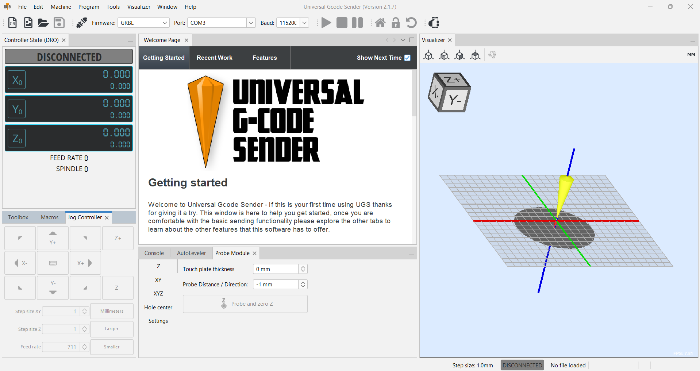
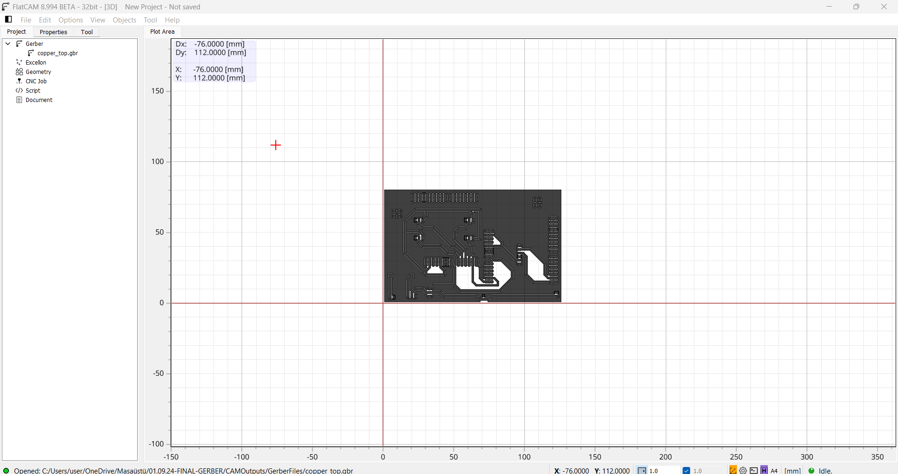

# How Can I Use CNC-3018 Router For PCB Prototyping ?

<b> ~~~~~~~~~~CARVE THE TRACES OF YOUR MIND INTO COPPER~~~~~~~~~~
</b> 
  

# Step By Step PCB Production 

All the steps I have used to made PCB prototyping
  
Step |     Process  | Description / Source    |
|--|--------------|--------------------|
|1   |  Downland Universal G Code Sender (UGS) Program                       | https://winder.github.io/ugs_website/download/
|2   |  Making Adjustments Within The UGS Program                            | Establishing The Connection Between The Computer And The CNC-Router,Adjusting Engraving Environment
|3   |  Hardware Design                                                      | Create a Gerber File From Your Design
|4   |  Downland FlatCAM Program                                             | 
|5   |  Single Layer PCB Prototyping-2D CAM Process                          | Get the G Code from CAM
|6   |  Single Layer PCB Prototyping-Preparing The Engraving Environment     | Get the G Code from CAM
|7   |  Single Layer PCB Prototyping-Reset X,Y Zero And Probbing             | Get the G Code from CAM 
|8   |  Single Layer PCB Prototyping-Surface Mapping                         | Get the G Code from CAM 
|9   |  Single Layer PCB Prototyping-Top Layer Engraving                     | Get the G Code from CAM 
|10  |  Single Layer PCB Prototyping-Drilling The Holes                      | Get the G Code from CAM 
|11  |  Single Layer PCB Prototyping-Profile&Border Cutting                  | Get the G Code from CAM
|12  |  Single Layer PCB Prototyping-Notes For Post-Prototyping              | Get the G Code from CAM
|13  |  Double Layer PCB Prototyping-2D CAM Process                          | Get the G Code from CAM
|14  |  Double Layer PCB Prototyping-Preparing The Engraving Environment     | Get the G Code from CAM
|15  |  Double Layer PCB Prototyping-Reset X,Y Zero And Probbing             | Get the G Code from CAM 
|16  |  Double Layer PCB Prototyping-Surface Mapping                         | Get the G Code from CAM 
|17  |  Double Layer PCB Prototyping-Top Layer Engraving                     | Get the G Code from CAM
|18  |  Double Layer PCB Prototyping-Alligment Drills                        | Get the G Code from CAM
|19  |  Double Layer PCB Prototyping-Bottom Layer Engraving                  | Get the G Code from CAM
|20  |  Double Layer PCB Prototyping-Drilling The Holes                      | Get the G Code from CAM 
|21  |  Double Layer PCB Prototyping-Profile&Border Cutting                  | Get the G Code from CAM
|22  |  Double Layer PCB Prototyping-Notes For Post-Prototyping              | Get the G Code from CAM

# Downland Universal G Code Sender Program
Universal G-code Sender, often abbreviated as UGS, is a cross-platform Java-based program designed to stream G-code to CNC machines, offering an easy interface and real-time control over operations. G-code is the language used to instruct CNC machines how to move, cut, and drill according to a specific design. UGS acts as a bridge between your computer and your CNC machine, ensuring that the machine follows your commands accurately.

->UGS works with a variety of CNC machines and is compatible with several hardware controllers, including GRBL, TinyG, and Smoothieboard.

->UGS's dashboard provides essential information such as job progress, spindle speed, and machine coordinates, making it easy to monitor and control your CNC machine.

->UGS is its ability to control CNC machines in real-time. You can pause, stop, or adjust the machine's actions as needed. This is particularly useful when running long or complex operations where unexpected issues may arise, requiring on-the-fly adjustments.

->UGS is its 3D G-code visualization tool, which provides a graphical representation of the toolpath before it is sent to the CNC machine. This feature is invaluable in catching potential mistakes in the G-code or previewing how the machine will move. You can zoom in, rotate, and analyze the toolpath in detail, ensuring that the operations will go smoothly.

->UGS supports precise machine positioning using its built-in jogging controls. Whether you’re setting the origin point or moving the machine to specific coordinates, UGS offers smooth and precise control. Additionally, for CNC machines with probing capabilities, UGS supports probing commands, enabling automated measurement and alignment also by using UGS AutoLeveler you can create surface map for precise manufacturing.

<b> After a short theoretical introduction, let's start the program;
</b> 

# Making Adjustments Within The UGS Program 

<b> Fig.1 Interface of UGS Program
</b> 

In the UGS program, which we will use all its features later,Now all we need to do is establish the connection between the computer and the CNC router and after this connection, move the spindle to a suitable region and height with some jogging maneuvers.

For Connections;

Note:In CNC control card,making sure that you connect the power,USB port and open the switch before these steps;

1-Firmware - GRBL

2-Port - Choose True Port Between CNC Router and PC.

3-Baud - Choose Proper Baud Between CNC Router and PC. (Recommended Value is 115200 bit/sec)

4-After Making Sure These Parameters,You Can Connect CNC Router and PC By Clicking Conncetion Icon.

For Jogging;

Thanks to the controller located at the bottom left of the program and based on Cartesian axes, the spindle is easily pulled into the appropriate area.
Also we have an adjustment area for how far to go with each click, on the XY and Z axes separately (Step Size).

# Hardware Design 

In this area, instead of providing basic hardware design information, I will talk about important design parameters for CNC-Router.

1-Track Width:

During design, one of the main parameters is the thickness of our roads. This thickness is determined to be suitable for certain purposes and the electric current that will pass.

This value is really important when using a CNC Router. In addition to the theoretically appropriate thickness you have found, it is recommended to give a value around 30% higher due to some additional parameters and unintentional errors.

2-DRC Parameters:

2a-(Wire-Pad-Via) Clearance

The distance between these elements(Wire-Pad-Via), which serve as carriers of different signals, is perhaps the most important parameter in the production phase. Here, depending on the adequacy of the machine and the possibility of errors, it is recommended to give a value of at least 25% more to protect against possible errors and short circuits.

2b-Other DRC Parameters

Sizes, distances and related variables are also expected to be suitable for the production area. If necessary, it is recommended to increase within a sufficient tolerance range to avoid an error.

After we are sure of all these processes and design, we take our production files, called gerber, from the application we chose for hardware design and start the CAM process.

# Downland FlatCAM Program
FlatCAM is an open-source PCB CAM (Computer-Aided Manufacturing) software that is specifically designed to take your Gerber files and transform them into G-code instructions.Gerber files are the standard output from PCB design software such as KiCAD, Eagle, or Altium Designer, and they provide the detailed information about each layer of the PCB, including the traces, holes, and silkscreen.By using FlatCAM, you can mill your PCBs with a CNC router, effectively skipping the need for chemical etching methods, which can be messy and hazardous. FlatCAM also supports Excellon drill files, allowing you to mill traces and drill holes in the same workflow.

FlatCAM doesn’t just stop at converting Gerber files—it also offers powerful geometry editing tools that allow users to manipulate their PCB designs directly in the software. You can edit traces, pads, and routes, or add new geometric elements like text, lines, and shapes to further customize your board.

Double-Sided PCB Support For users creating more complex double-sided PCBs, FlatCAM makes it easy to manage and align the top and bottom layers. It includes built-in support for double-sided board milling, where the software helps you to precisely align both sides of your PCB to ensure accurate routing and drilling.

Toolpath Optimization Efficient toolpath generation is crucial to minimizing machine time and improving the quality of your PCBs. FlatCAM offers several optimization tools that ensure the CNC machine follows an efficient path when milling the board. This reduces machine wear and tear and cuts down on fabrication time.

Isolation Routing One of the standout features of FlatCAM is its isolation routing capability, which involves generating a toolpath around copper traces to isolate them from the surrounding copper. This is especially useful when milling traces instead of using traditional etching methods. FlatCAM provides precise control over the isolation process, allowing users to adjust the width of the routed path and ensure proper separation between traces.

Drill and Cutout Generation Besides milling the copper traces, FlatCAM can also generate drill paths for component holes and toolpaths for cutting out the final PCB shape from the material. You can set the depth and size of the drilled holes based on the Excellon files generated by your PCB design software, ensuring compatibility with various components.

FlatCAM allows users to define and customize their tool libraries, enabling precise control over the milling and drilling process. You can specify different end mills or drill bits based on the type of material, desired trace width, or hole size. This level of customization is crucial for ensuring that your CNC machine operates with the correct tools for each specific job.

<b> Fig.2 Interface of flatCAM Program
</b> 
Single Layer PCB Prototyping-2D CAM Process 
